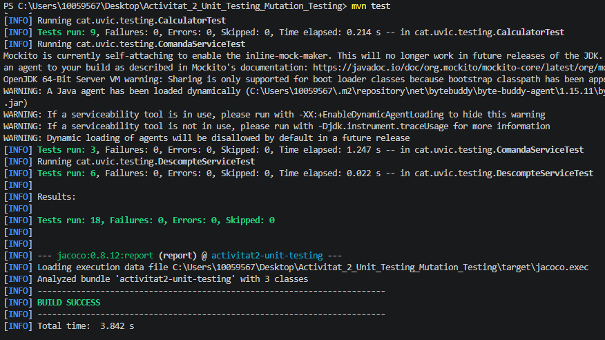
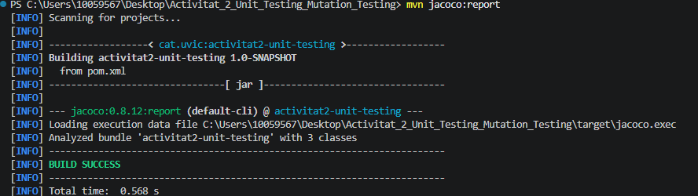
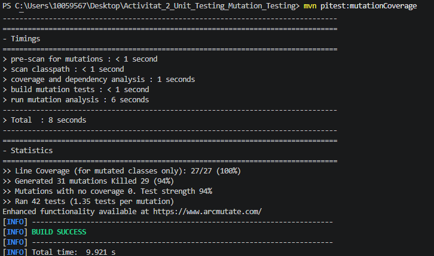

# PAC 2: Unit Testing i Mutation Testing

Aquest repositori conté la solució a la Pràctica d'Avaluació Continuada 2. S'ha implementat una suite de proves unitàries amb JUnit 5 i Mockito, i s'ha analitzat la cobertura i qualitat del codi amb JaCoCo i PIT.

## 1. Execució dels tests

Per executar totes les proves del projecte, utilitzem la comanda:
`mvn test`

Tal com es pot veure a la imatge inferior, s'executen un total de 18 tests (9 de la calculadora, 3 de la comanda i 6 dels descomptes) i tots passen correctament sense cap error.

## 2. Cobertura de codi (JaCoCo)

Per generar l'informe de cobertura, hem executat la comanda:
`mvn jacoco:report`

L'informe ens indica que hem assolit un 100% de cobertura d'instruccions i un 94% de cobertura de branques a les tres classes del projecte. 

## 3. Anàlisi de Mutants (PIT)

Finalment, per mesurar la qualitat dels tests hem executat:
`mvn pitest:mutationCoverage`

El resultat és d'un 94% de Mutation Coverage, ja que els tests han detectat i eliminat 29 dels 31 mutants generats. Els 2 mutants que han sobreviscut a les proves són els següents:

*   **Primer mutant (Calculator.java - Línia 14 `return a * b;`)**: Ha sobreviscut perquè el test que tenim comprova la multiplicació per zero (5 * 0 = 0). Si el mutant canvia el codi internament perquè la funció retorni sempre un 0, el test rep justament el que esperava i es pensa que tot està bé. Per solucionar-ho i eliminar el mutant, només caldria afegir un altre test que multipliqui valors diferents de zero (com per exemple 2 * 3 = 6).
*   **Segon mutant (DescompteService.java - Línia 7 `if (importCompra < 0)`)**: Aquest ha sobreviscut perquè el mutant ha canviat el símbol estricte `<` per un `<=`. Com que al nostre test d'excepció només hem comprovat el valor negatiu -1.0, l'excepció salta igualment en tots dos casos i el test no s'adona de la trampa. Per matar aquest mutant, hauríem d'afegir un test amb el valor límit exacte (0.0) per confirmar que no salta cap excepció just en aquell punt.

## 4. Preguntes de reflexió

**1. Quina diferència has observat entre que una línia estigui coberta i que el comportament estigui ben provat?**
Que una línia estigui coberta només ens garanteix que el programa ha passat per allà durant l'execució del test. Però que el comportament estigui ben provat vol dir que hem validat de veritat (amb els assert) que el resultat que dóna aquella línia és exactament l'esperat segons la lògica de negoci, tenint en compte tots els escenaris.

**2. Què t’ha aportat PIT que no t’havia mostrat l’informe de JaCoCo?**
PIT m'ha servit per comprovar si els meus tests són realment forts. JaCoCo només em deia quines línies s'havien llegit, però PIT, al posar errors expressament al codi, m'ha demostrat que tot i tenir un 100% de cobertura amb JaCoCo, algun test es podia deixar enganyar si fallava la lògica interna del programa.

**3. Quin valor límit ha estat més rellevant en DescompteService i per què?**
Els valors clau han estat el 100.0 i el 99.99. Són molt importants perquè marquen just la frontera on es comença a aplicar el descompte (la condició és `>= 100`). Si ens equivoquéssim de símbol i poséssim només un `>`, l'única manera de detectar l'error seria provant aquests valors límit.

**4. En quin cas t’ha resultat útil el mock de StockRepository?**
El mock m'ha anat molt bé a la classe `ComandaService` per poder provar-la de forma totalment aïllada. En comptes d'haver-me de connectar a una base de dades de veritat per mirar l'estoc, el mock m'ha permès simular les respostes (quan hi ha estoc i quan no) de forma molt ràpida per provar només la lògica del servei.

**5. Quin test de la teva suite consideres que aporta més valor i per què?**
El que considero que aporta més valor és el test parametritzat de `DescompteService`. M'agrada molt perquè permet agrupar tota la taula de combinacions de l'enunciat (tipus de client i imports) en un sol mètode molt net. Això fa que el codi sigui molt fàcil d'entendre i de mantenir en el futur.